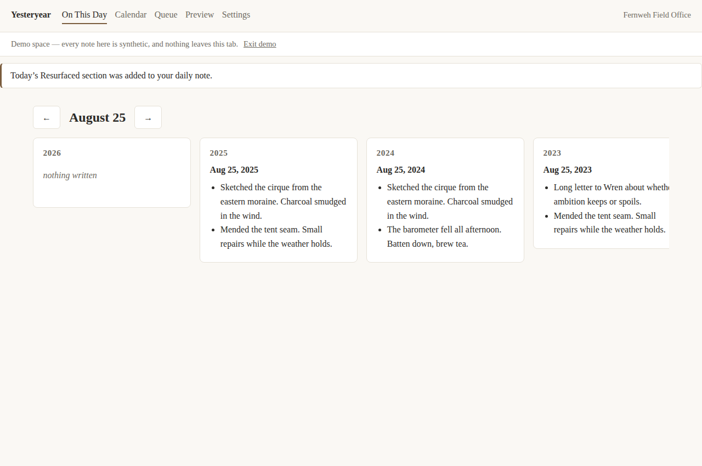
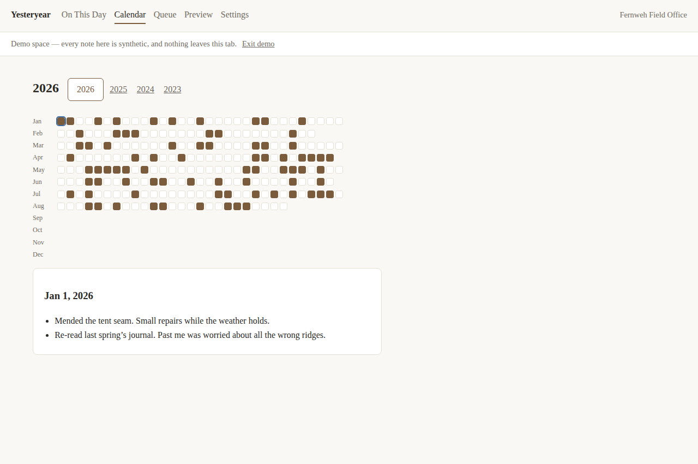

# Yesteryear

**Resurfacing for Capacities.** See what you wrote on this day across every
past year, rotate gently through the notes you tagged as worth meeting again,
and — if you opt in — space a few things toward a real date.



> **Disclaimer:** Yesteryear is an independent community tool. It is not
> affiliated with, endorsed by, or sponsored by Capacities. Capacities is a
> trademark of its respective owners.

Notes go into a PKM tool far more easily than they come back out. Capacities
is excellent at capture and connection, but nothing brings your older writing
back in front of you at the right moment — the insight you tagged in March, the
project you started a year ago today, the friend whose birthday is Thursday.
Yesteryear is that other half: a resurfacing engine that reads your space and
puts your own past back into view, on the site and (optionally) as a small
`Resurfaced` section in the daily note you already open every morning.

## No backend, no telemetry

Yesteryear is **plain static files**. OAuth happens in your browser, tokens
stay in your browser, and every API call goes from your browser directly to
`api.capacities.io`. No note content ever passes through a server the
maintainer controls — there is no server. No accounts, no analytics, no
tracking of any kind, and a strict Content-Security-Policy backs that up.

Honest tradeoff, stated rather than hidden: browser-stored tokens are
reachable by any script that runs on the page. That is why this app bundles
everything, loads no third-party scripts, and treats every dependency as a
review item (the runtime dependencies are `preact`, the official
`@capacities/api` SDK, and its `zod` peer — that's the list). Browser storage
is still not an OS keychain; you can revoke Yesteryear's access at any time in
Capacities under **Settings → Capacities API → Connections**, independent of
anything this app does.

Your resurfacing history lives in a `Yesteryear State` page **inside your own
space** — inspect it, export it as JSON from Settings, or delete it to start
fresh. Clearing browser data only signs you out; reconnecting restores
everything, because the state was never only local.

## Works with *your* object types, not mine

Every Capacities space has different object types, properties, and tags, so
**not one type ID, property ID, or tag name is hardcoded**. Yesteryear reads
what your space actually contains and you map it in the settings form: which
type plays the role of "projects" or "people", which date property is a
birthday, which tags mark something resurfaceable, which status values count
as in-flight. Anything you don't map is silently skipped — a space with
nothing configured at all still gets "on this day", because daily notes exist
everywhere. If a configured name doesn't exist in your space, the error names
what was missing and lists what your space actually has.

## Getting started

1. Open the site and click **Connect to Capacities** (or **Try the demo**
   first — it runs on a synthetic space, no account needed).
2. Approve access and pick which space to share — that choice happens on
   Capacities' side.
3. You land on **On This Day**: today's date across every past year. That
   already works, with zero configuration.
4. In **Settings**, pick your own object types, date properties, and tags —
   everything is optional.
5. Check **Preview** to see exactly what tomorrow would surface, before
   anything is written.
6. If you like it, enable the **daily note** surface. On your first visit each
   day, a `Resurfaced` section is appended to that day's note.

Responding is optional, in the note itself: check the box (or strike `keep`)
to keep something in rotation, strike `dismiss` to rest it three times longer,
strike `retire` to never see it again. **No response is always fine** — items
simply continue on their normal cooldown. Nothing is ever removed without an
explicit retire, and you can edit or delete the whole section freely; the
parser treats hand-edited notes as normal, not as errors.

## The two modes

**Recall** (default) is not spaced repetition, on purpose: personal notes have
no deadline, so there is no memory schedule to optimize. Instead: a 45-day
cooldown, weighted sampling that favors neglected groups and less-recently-seen
items, and a deliberate 20% slice of pure randomness — surprising juxtaposition
is where the insight comes from.

**Learn** (opt-in) is for the few notes you want fluent before a known date —
a talk, an exam, a trip. Gaps are computed as a ratio of the time remaining
(`0.15 ×` days to target, clamped), contracting as the date approaches, with
the first review always delayed. After the date passes, items revert to Recall
rather than disappearing. Learn mode is deliberately minimal: no cloze
deletions, no grading ladders. If you need real memorization tooling, use
[Anki](https://apps.ankiweb.net/) — Learn mode exists for notes you already
have, because getting notes into Anki is itself the friction.

No streaks, no counters, no guilt anywhere. An untouched queue is a normal
state.



## Built on the official API

Yesteryear uses the official Capacities HTTP API via the official
[`@capacities/api`](https://www.npmjs.com/package/@capacities/api) TypeScript
SDK, with OAuth 2.1 + PKCE — no static API tokens, and none of the app's
internal/undocumented interfaces that some community tools depend on. That
choice is about durability: when the API evolves, this keeps working.

## Deploying your own

The site deploys to any static host — no server functions needed.

```sh
npm install
VITE_CAPACITIES_CLIENT_ID=<your client id> npm run build   # output in dist/
```

The OAuth `client_id` comes from Capacities: registration is
[by email](https://developers.capacities.io), and you register your own
`/callback` URL as the redirect URI. The id is public by design (PKCE public
client — no client secret exists). Without one configured, the site still
serves the demo.

## Development

```sh
npm install
npm test        # Vitest — the whole engine runs against synthetic fixture spaces
npm run dev     # local dev server
npm run build   # typecheck + production build
```

The engine (`src/engine/`) is pure TypeScript with no Capacities or DOM
imports — providers implement a small interface, which is also what would make
an adapter for another PKM tool possible. See [CONTRIBUTING.md](CONTRIBUTING.md).

## License

[MIT](LICENSE)
